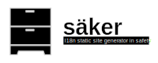

[![Build Status][build-status]][build-url]
[![Crates.io][crates-badge]][crates-url]
[![MIT licensed][mit-badge]][mit-url]

[crates-badge]: https://img.shields.io/crates/v/saker.svg
[crates-url]: https://crates.io/crates/saker
[mit-badge]: https://img.shields.io/badge/license-MIT-blue.svg
[mit-url]: https://github.com/plabayo/saker/blob/main/LICENSE
[build-status]: https://github.com/plabayo/saker/actions/workflows/CI.yml/badge.svg?branch=main
[build-url]: https://github.com/plabayo/saker/actions/workflows/CI.yml

[Website](https://github.com/plabayo/saker) |
[API Docs](https://docs.rs/saker)

> **WARNING**: this project is a wild west research project, use at your own risk.
> You can contact [glen@plabayo.tech](mailto:glen@plabayo.tech) if you want to get involved.

## Safety

These crates uses `#![forbid(unsafe_code)]` to ensure everything is implemented in
100% safe Rust.

## Minimum supported Rust version

`saker`'s MSRV is 1.60.

## Contributing

:balloon: Thanks for your help improving the project! We are so happy to have
you! We have a [contributing guide][contributing] to help you get involved in the
`saker` project.

## License

This project is licensed under the [MIT license][license].

### Contribution

Unless you explicitly state otherwise, any contribution intentionally submitted
for inclusion in `saker` by you, shall be licensed as MIT, without any
additional terms or conditions.

[contributing]: https://github.com/plabayo/saker/blob/main/CONTRIBUTING.md
[license]: https://github.com/plabayo/saker/blob/main/saker/LICENSE
